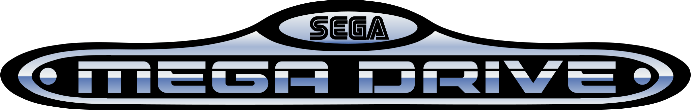
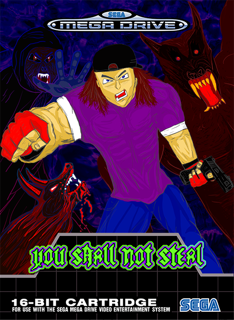

[Bala](#bala) |
[Games](#games) |
[Links](#links) |

  

# Bala
I’m Mike Bala, a programmer/musician. Although I’ve made some games in the past, I’ve always dreamt of making games for the Sega Mega Drive or Master System. Nowadays those dreams can be achieved more easily with the help of tools like SGDK etc.
 
My main goals when making a game are:
- [x] Addictive gameplay
- [x] To make something a bit different

For now I'm running a one man show but I surely could have some help in the future, especially in the graphic department.

  

# Games

  

## **YOU SHALL NOT STEAL**

 

>Two burglars try to break into a house but end up in the worst nightmare of their lives. You play as John, a man that is paying a high price for his mistake. Wake up in a dungeon just in time to be the next guinea pig of a crazy secret society that gets some help from the authorities.
>
>Fight for your life!

 

System          | *Sega Mega Drive / Genesis*
---             | ---
Release Date    |  Jan 20, 2023
Genre           | *Beat 'em Up / Platformer / Survival horror*
Publisher       | Bala
Game Designer   | Bala
Programmer      | Bala
Graphics        | Bala
Music           | Bala
SFX (except mechanical noises)  | Bala

 

# Links

 [GitHub](https://zombierust.github.io/)

 [Twitter](https://twitter.com/bulletguitar)

 [YouTube](https://www.youtube.com/@balagamedev)

